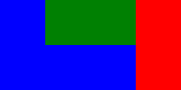

Today we're releasing React Native 0.74!...

## Notable

<!-- https://github.com/facebook/react-native/blob/main/CHANGELOG.md -->

- React Native Frameworks
- New layout behaviors
- `align-content: 'space-evenly'`
- `position: 'static'` (when using the New Architecture)
- Batched updates for `onLayout` (New Architecture only?)
- Preparing for the New Architecture?
- Deprecated APIs in `PushNotificationIOS`
- Removed [deprecated prop types](https://github.com/facebook/react-native/commit/228cb80af9ded20107f3c7a30ffe00e24471bfeb)
- Android SDK minimum bump (Android 6.0)

<!--truncate-->

## React Native Frameworks

- https://github.com/react-native-community/discussions-and-proposals/blob/main/proposals/0759-react-native-frameworks.md
  - Contextualize what changes are coming into 0.74 from proposal
- Warning on using react-native init https://github.com/facebook/react-native/commit/a6397afb7f4279e70afa025fe6f9fa0b8e3de3fd

## New layout behaviors

React Native 0.74 includes [changes to Yoga](https://yogalayout.dev/blog/announcing-yoga-3.0) which enable more correct layout. These changes make Flexbox and the box model work more predictably, and enables laying our styles written for web with greater fidelity.

We are mindful that layout changes can effect the appearance of existing components. React Native opts out of layout behavior changes in Yoga which impact a significant number of existing components. We have opted to fix some bugs which may impact a very small number of existing layouts.

:::warning

React Native [previously flipped](https://yogalayout.dev/blog/announcing-yoga-3.0#correct-handling-of-logical-edges-in-row-reverse-containers) `left`/`right` (and `start`/`end`) edges when dealing with `margin`, `padding`, or `border`, set on a `row-reverse` container. Code which previously relied on edges being inverted may need to be updated to continue rendering correctly.

<table>

<tr>
<td>Style</td><td>Before</td><td>After</td>
</tr>

<tr>

<td width="350">

```jsx
<View
  style={{
    flexDirection: 'row',
    backgroundColor: 'red',
    margin: 10,
    width: 200,
    height: 100,
  }}>
  <View
    style={{
      flexDirection: 'row-reverse',
      backgroundColor: 'blue',
      flex: 1,
      marginLeft: 50,
    }}>
    <View
      style={{
        backgroundColor: 'green',
        height: '50%',
        flex: 1,
        marginLeft: 50,
      }}
    />
  </View>
</View>
```

</td>

<td>



</td>

<td>


</td>

</tr>

</table>

:::

## `align-content: 'space-evenly'`

Containers now support [`alignContent: 'space-evenly'`](https://developer.mozilla.org/en-US/docs/Web/CSS/align-content#space-evenly), to evenly distribute the space between line-boxes in multi-line flex containers.

<a href="https://www.w3.org/TR/css-align-3/#distribution-values">

</a>

## `position: 'static'` (when using the New Architecture)

[`position: 'static'`](https://developer.mozilla.org/en-US/docs/Web/CSS/position#static) is now supported when targeting the new architecture. Elements marked as `position: 'static'` are not considered when determining the [containing block](https://developer.mozilla.org/en-US/docs/Web/CSS/Containing_block) of an absolutely positioned element. This allows absolutely positioning an element relative to an ancestor which is not its direct parent.

[Picture?]

`position: 'static'` may also effect [z-ordering](https://developer.mozilla.org/en-US/docs/Web/CSS/CSS_positioned_layout/Understanding_z-index/Stacking_context) of views.

[Picture?]

React Native continues to default to `position: 'relative'` when no `position` is set.

## Preparing for the New Architecture

- bridgeless by default?
- link out to separate New Architecture update?
- point to New Architecture landing page

## Batched `onLayout` updates (New Architecture)

State updates in `onLayout` callbacks are now batched. Prior, each state update in the `onLayout` event would result in a new render commit.

```jsx
function MyComponent(props) {
  const [state1, setState1] = useState(false);
  const [state2, setState2] = useState(false);

  return (
    <View>
      <View
        onLayout={() => {
          setState1(true);
       }}>
      <View
         onLayout={() => {
          // When this event is executed, state1's new value is no longer observable here.
          setState2(true);
        }}>
 	    </View>
    </View>
  );
}
```

In 0.74, `setState1` and `setState2` updates are batched together. This change is [expected behavior in React](https://react.dev/learn/queueing-a-series-of-state-updates#react-batches-state-updates) and allows for less re-renders.

:::danger
This change may break code that has relied on un-batched state updates. You'll need to refactor this code to use [updater functions](https://react.dev/learn/queueing-a-series-of-state-updates#updating-the-same-state-multiple-times-before-the-next-render) or equivalent.
:::

## Deprecated `PropTypes` have been removed

0.74 removes the following deprecated properties from React Native:

- `Image.propTypes`
- `Text.propTypes`
- `TextInput.propTypes`
- `ColorPropType`
- `EdgeInsetsPropType`
- `PointPropType`
- `ViewPropTypes`

Here is a summary of the deprecation history for prop types:

- `react@15.5` extracted `prop-types` into a separate package to reflect that not everybody uses them.
- `react-native@0.68` added a deprecation warning to built-in prop types. [(3f62904)](https://github.com/facebook/react-native/commit/3f629049ba9773793978cf9093c7a71af15e3e8d)
- `react-native@0.69` removed built-in prop types. [(3e229f2)](https://github.com/facebook/react-native/commit/3e229f27bc9c7556876ff776abf70147289d544b)
- `react-native@0.71` restored built-in prop types, along with bug fixes to isolate deprecated usage. [(b966d29)](https://github.com/facebook/react-native/commit/b966d297245a4c1e2c744cfe571396cfa7e5ffd3)

**If anyone has trouble identifying the source of a deleted prop types usage, please file an issue so we can help track it down with you.**

## Deprecated APIs in `PushNotificationIOS`

:::warning
The [PushNotificationIOS](https://reactnative.dev/docs/pushnotificationios) library is marked as deprecated. The changes in this release are focused on removing references to deprecated iOS APIs. In a future release, this library will be moved out of react-native core and converged with the community package, [@react-native-community/push-notification-ios](https://github.com/react-native-push-notification/ios).
:::

[PushNotificationIOS](https://reactnative.dev/docs/pushnotificationios) has been migrated onto Apple’s [User Notification](https://developer.apple.com/documentation/usernotifications?language=objc) framework and exposes new APIs for scheduling and handling notifications. If you are still relying on PushNotificationIOS, you’ll need to migrate over before the next release (0.75) when the deprecated APIs will be removed.

### API Changes

The `didRegisterUserNotificationSettings:` callback on `RCTPushNotificationManager` was a no-op and has been deleted.

The following callbacks on `RCTPushNotificationManager` have been deprecated and will be removed in 0.75:

```objectivec
+ (void)didReceiveLocalNotification:(UILocalNotification *)notification;
+ (void)didReceiveRemoteNotification:(NSDictionary *)notification;
```

In order to retrieve the notification which launched the app using `getInitialNotification()`, you’ll now need to explicitly set the `initialNotification` on `RCTPushNotificationManager`:

```objectivec
[RCTPushNotificationManager setInitialNotification:response.notification];
```

On the JS side, properties on `Notification` have changed. `alertAction` and `repeatInterval` are now deprecated and will be removed in 0.75:

```js
type Notification = {|
 ...
 +fireDate?: ?number,
 /** NEW. Seconds from now to display the notification. */
 +fireIntervalSeconds?: ?number,
 /**
  * CHANGED. Used only for scheduling notifications. Will be null when
  * retrieving notifications using `getScheduledLocalNotifications` or
  * `getDeliveredNotifications`.
  */
 +soundName?: ?string,
 /** DEPRECATED. This was used for iOS's legacy UILocalNotification. */
 +alertAction?: ?string,
 /** DEPRECATED. Use `fireDate` or `fireIntervalSeconds` instead. */
 +repeatInterval?: ?string,
|};

```

Finally, the `handler` parameter on `PushNotificationIOS.removeEventListener` is unused and has been removed.

### How to Migrate

#### iOS

Your `AppDelegate` will need to implement `UNUserNotificationCenterDelegate`. This should be done on app startup in `application:willFinishLaunchingWithOptions:` or `application:didFinishLaunchingWithOptions:` (see [Apple Docs](https://developer.apple.com/documentation/usernotifications/unusernotificationcenterdelegate?language=objc) for more details).

```objectivec
- (BOOL)application:(UIApplication *)application didFinishLaunchingWithOptions:(NSDictionary *)launchOptions
{
  ...
  UNUserNotificationCenter *center = [UNUserNotificationCenter currentNotificationCenter];
  center.delegate = self;

  return YES;
}
```

Implement <code>[userNotificationCenter:willPresentNotification:withCompletionHandler:](https://developer.apple.com/documentation/usernotifications/unusernotificationcenterdelegate/1649518-usernotificationcenter?language=objc)</code>, which is called when a notification arrives and the app is in the <em>foreground</em>. Use the <code>completionHandler</code> to determine if the notification will be shown to the user and notify <code>RCTPushNotificationManager</code> accordingly:

```objectivec
- (void)userNotificationCenter:(UNUserNotificationCenter *)center
       willPresentNotification:(UNNotification *)notification
         withCompletionHandler:(void (^)(UNNotificationPresentationOptions options))completionHandler
{
  // This will trigger 'notification' and 'localNotification' events on PushNotificationIOS
  [RCTPushNotificationManager didReceiveNotification:notification];
  // Decide if and how the notification will be shown to the user
  completionHandler(UNNotificationPresentationOptionNone);
}
```

To handle when a notification is tapped, implement <code>[userNotificationCenter:didReceiveNotificationResponse:withCompletionHandler:](https://developer.apple.com/documentation/usernotifications/unusernotificationcenterdelegate/1649501-usernotificationcenter?language=objc)</code>. Note that if you set foreground notifications to be shown in <code>userNotificationCenter:willPresentNotification:withCompletionHandler:</code>, you should only notify <code>RCTPushNotificationManager</code> in one of these callbacks.

If the tapped notification resulted in app launch, call `setInitialNotification:`. If the notification was not previously handled by `userNotificationCenter:willPresentNotification:withCompletionHandler:`, call `didReceiveNotification:` as well:

```objectivec
- (void)  userNotificationCenter:(UNUserNotificationCenter *)center
  didReceiveNotificationResponse:(UNNotificationResponse *)response
           withCompletionHandler:(void (^)(void))completionHandler
{
  // This condition passes if the notification was tapped to launch the app
  if ([response.actionIdentifier isEqualToString:UNNotificationDefaultActionIdentifier]) {
  // Allow the notification to be retrieved on the JS side using getInitialNotification()
    [RCTPushNotificationManager setInitialNotification:response.notification];
  }
 // This will trigger 'notification' and 'localNotification' events on PushNotificationIOS
  [RCTPushNotificationManager didReceiveNotification:response.notification];
  completionHandler();
}
```

Finally, delete the following methods and adapt the logic into the callbacks above which will be called instead:

1. <code>[application:didReceiveLocalNotification:](https://developer.apple.com/documentation/uikit/uiapplicationdelegate/1622930-application?language=objc)</code> [deprecated]
2. <code>[application:didReceiveRemoteNotification:](https://developer.apple.com/documentation/uikit/uiapplicationdelegate/1623117-application?language=objc)</code> [deprecated]
3. <code>[application:didReceiveRemoteNotification:fetchCompletionHandler:](https://developer.apple.com/documentation/uikit/uiapplicationdelegate/1623013-application?language=objc)</code> [not deprecated, but is superseded by the <code>UNUserNotificationCenterDelegate</code> methods]

Delete any usages of <code>[application:didRegisterUserNotificationSettings:](https://developer.apple.com/documentation/uikit/uiapplicationdelegate/1623022-application?language=objc)</code> and <code>RCTPushNotificationManager</code>’s corresponding <code>didRegisterUserNotificationSettings:</code> as well.

**Example:** See the RNTester <code>[AppDelegate.mm](https://github.com/facebook/react-native/blob/main/packages/rn-tester/RNTester/AppDelegate.mm)</code>.

#### JS

1. Remove any references to `alertAction`.
2. Remove the `handler` argument on any calls to `removeEventListener`.
3. Replace any usages of `repeatInterval` by firing multiple notifications using `fireDate` or `fireIntervalSeconds` instead.
4. Note that `soundName` will be null when it is accessed on a `Notification` returned from `getScheduledLocalNotifications()` and `getDeliveredNotifications()`.

## Acknowledgements

-

## Upgrade to 0.74

Please use the [React Native Upgrade Helper](https://react-native-community.github.io/upgrade-helper/) to view code changes between React Native versions for existing projects, in addition to the [Upgrading docs](/docs/upgrading). You can also create a new project with `npx react-native@latest init MyProject`.

If you use Expo, React Native 0.73 will be supported in the Expo SDK 50 release.

:::info
0.73 is now the latest stable version of React Native and **0.70.x now moves to unsupported**. For more information see [React Native’s support policy](https://github.com/reactwg/react-native-releases#releases-support-policy).
:::
